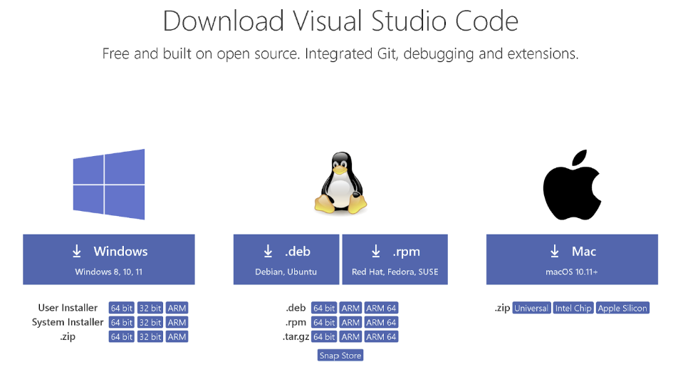

# Lab 1

## Install VScode

To install VScode, go to https://code.visualstudio.com/download

 

Once VScode is installed, you should see a page similar to this

 

## Connecting with SSH

To connect with SSH, first install OpenSSH. On a Windows computer, navigate to Settings>Apps>Optional Features. Search for OpenSSH Client, and install it if it is not already installed.

 

Next open a terminal in VScode, by going to Termina > New Terminal

Type in the following: ssh cs15lfa22xx@ieng6.ucsd.edu
Login using your password and replace the “xx” with your correct credentials.
On a successful login, you should see a screen similar to this

 

The terminal will also have a [cs15lfa22xx@ieng6.ucsd.edu] followed by :~: and a number.

If prompted with a message asking about the authenticity host not being established, type in yes into the terminal.

 

## Run Some Commands

Here are some useful commands:

* ls: lists files in the current directory
* cd: changes the directory
* cp: copies a file
* cat: lists the contents of a file
* ssh: securely connects to a remote computer
* scp: copies a file to a remote computer using ssh

Here are some examples:

* "cd ~" will take you to the home directory

* cat ".\helloWorld.txt" will print the contents of helloWorld.txt

## Moving Files with SSH and scp

To copy a file to a remote computer, use the scp command

<b> scp filename remoteservername </b>

Once copied, you will see the file in the remote computer

Here is an example of a java file that was copied, which displays the current directories, os name, username, and more:

## Creating SSH Keys

Sometimes it is annoying to keep typing in a password when logging into a remote computer using ssh. SSH keys enable the remote computer to store a public key, and compare it with a private key on the local machine. If the keys are a pair, then access is granted.

Here is how to create a key:

* Type in ssh-keygen
* When prompted about what file to save the key in, press enter to save it in the default path
* Now, login to the remote computer, and create a directory called .ssh using mkdir
* Back on the local machine, scp the id_rsa.pub key to the remote machine in the path that the keys were saved in

After creating the keys, you should now be able to login without the terminal prompting for a password:

## Simplifying Commands

A keystroke occurs whenever a key is pressed on the keyboard. A way to reduce keystrokes is to utilize semicolons and quotations in terminal commands.

* Using ; will run two commands on one line. For example, running javac HelloWorld.java ; java HelloWorld will run both javac and java commands, which will compile and run the program in one line.
* Using "" after an ssh login will run the command inside of the quotations using the remote machine. For example, ssh jkave@ieng6.ucsd.edu "ls" will run ls after logging into the remote machine at jkave@ieng6.ucsd.edu.

One combination is to use both ; and "" to copy a file and run it on a remote computer in one line. 

This command copies whereAmI.java to the remote server, then runs it using the javac and java commands. Using one line commands like these are useful because if you want to edit the file and recopy and run it, then all you have to do is press the up arrow and rerun the command.

