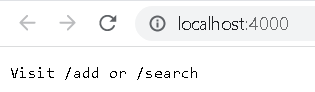
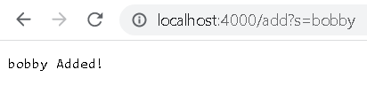
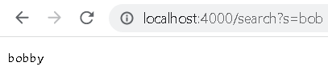

# Lab Report 2 and 3

## Lab 2

Here is my code for Lab 2

```
import java.io.IOException;
import java.net.URI;
import java.util.ArrayList;

class Handler implements URLHandler {

    ArrayList<String> list = new ArrayList<String>();

    public String handleRequest(URI url) {
        if(url.getPath().equals("/add")){
            String[] query = url.getQuery().split("=");
            if(query[0].equals("s")){
                list.add(query[1]);
            }

            return query[1] + " Added!";
        }
        else if(url.getPath().equals("/search")){
            String[] query = url.getQuery().split("=");
            if(query[0].equals("s")){
                String display = "";
                for(int i = 0; i < list.size(); i++){
                    if(list.get(i).contains(query[1])){
                        display += list.get(i) + ", ";
                    }
                }
                return display.substring(0,display.length() - 2);
            }
        }

        else if(url.getPath().equals("/")){
            return "Visit /add or /search";
        }
        else{
            return "404 Not Found!";
        }
        return "";
    }
}

class NumberServer {
    public static void main(String[] args) throws IOException {
        if(args.length == 0){
            System.out.println("Missing port number! Try any number between 1024 to 49151");
            return;
        }

        int port = Integer.parseInt(args[0]);

        Server.start(port, new Handler());
    }
}

```

Here are three screenshots of the search engine adding and showing words in storage.


</br>
* The methods called here are handleRequest, getPath(), and equals()
* The only argument taken for these methods is the url. getPath takes no argument, but identifies the path given in the url, which is the part after the "/". Equals() takes a "/" to see if the url is at the / path or not. 
*   These values do not change

<br/>
* The methods called here are handleRequest, getPath, equals, getQuery, split, and add.
* The arguments taken here are the url for handleRequest, /add and s for equals, = for split, and the query array created when splitting the query in the url for add. There is also the class field list, which is an ArrayList that stores the added words from the query in the url.
* The argument for equals changes from /add to s, because after checking for /add in the url, equals then checks if the first part of the query equals s.

<br/>
* The methods called here are handleRequest, getPath, equals, getQuery, split, contains, size, length, substring, and get.
* The arguments taken here are the url for handleRequest, /search and s for equals, = for split, a counter integer i for get, the resulting array from split for contains, and 0 and display.length() - 2 for substring. There is also the class field list which is an ArrayList that stores words in it, and is used to display words when the search path is called.
* The argument for equals changes from /search to s, because after checking for /search in the url, equals then checks if the first part of the query equals s. The counter integer i also changes because it is in a loop, and it is used as the parameter for get, which gets elements indexed at i in the class field list.

## Lab 3

**Bug 1**

Failure Inducing Input:


Failing Test Output:


Buggy Code:


Explanation:

When the code checks for the lowest number, it removes all numbers of the lowest value, instead of one. So if there exists multiple numbers in the array that are equal to the lowest value, it will calculate the average ignoring all of those numbers instead of one of them.

An example fix would be as follows, where check is a boolean intialized as true:


Here, check is set to false once a lowest number is found, which skips that specific lowest number, but includes every other lowest number since check is now always false.

**Bug 2**

Failure Inducing Input:


Failing Test Output:


Buggy Code:


Explanation:

When appending more than two elements to the linked list, the while loop includes adding a Node to n.next in the loop. So instead of looping to the end of the list then adding an element, it loops to the next element then adds an element, which keeps the loop running forever since n.next is never null.

Here is a fixed version:


The second line of the while loop is moved to the outside, so it is only run once n is at the end of the list.