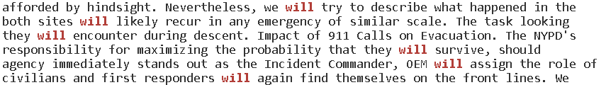
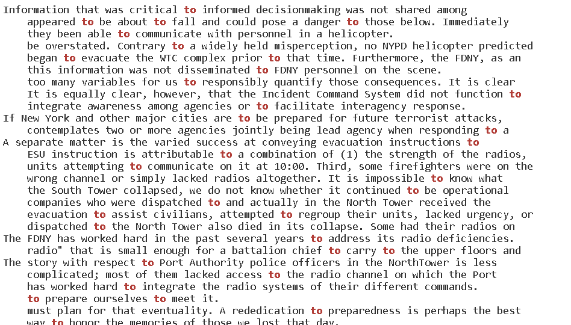

# Lab Report Week 5
## GREP

Grep is used to search for patterns and characters within files.

The -w option

```
grep at 911report/chapter-9.txt
```


Without the -w option, grep shows all lines with words containing "at".


```
grep -w at 911report/chapter-9.txt
```

With the -w option, only the lines with the word "at", not the substring, are displayed.

```
grep -w will 911report/chapter-9.txt
```



```
grep -w to 911report.chapter-9.txt
```



The -c option:

```
grep -c at 911report/chapter-9.txt
949
```

The -c option only displays the count of lines containing the pattern, and does not display the actual lines. Here, there are 949 lines containing "at" in the file "chapter-9.txt".

```
grep -c will 911report/chapter-9.txt
7
```

```
grep -c to 911report/chapter-9.txt
715
```

The -v option:

```
grep -v a 911report/preface.txt


            PREFACE
                27, 2002).
                public testimony from 160 witnesses.


```

The -v option displays all lines that do not contain the given parameter. Here, these lines are the only lines in preface.txt that do not contain the character "a". 

```
grep -v c 911report/preface.txt
PREFACE
27, 2002).
areas determined relevant by the Commission. In pursuing our mandate, we have
our mandate. We have sought to be independent, impartial, thorough, and nonpartisan.
Our aim has not been to assign individual blame. Our aim has been to provide the
learned.
enemy rallies broad support in the Arab and Muslim world by demanding redress of
together as a nation. The test before us is to sustain that unity of purpose and
think about the way our government is organized. The massive departments and
together over every page, and the report has benefited from this remarkable
to detail, and readiness to share what they have learned. We have built on the work
of several previous Commissions, and we thank the Congressional Joint Inquiry, whose
We want to note what we have done, and not done. We have endeavored to provide the
understanding of a landmark in the history of our nation.
have admired their determination to do their best to prevent another tragedy while
```
```
grep -v e 911report/preface.txt


            PREFACE
                27, 2002).
                accountability.
```
