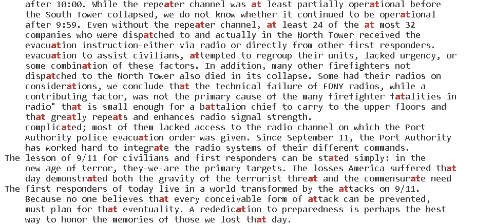
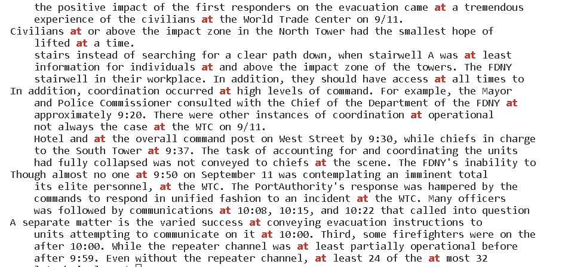

# Lab 5

## Less

The less command is used to show the contents of a file a page at a time. This is useful for loading large amounts of text, since it is much faster than loading everything at once.

The -X option:

```
less -x preface.txt

PREFACE
We present the narrative of this report and the       recommendations that flow from it to
the President of the United States, the United States Congress, and the American
people for their consideration. Ten Commissioners-five Republicans and five
Democrats chosen by elected leaders from our nation's capital at a time of great
partisan division-have come together to present this report without dissent.
We have come together with a unity of purpose because our nation demands it.
September 11, 2001, was a day of unprecedented shock and suffering in the history of
the United States. The nation was unprepared. How did this happen, and how can we
avoid such tragedy again?
To answer these questions, the Congress and the President created the National
Commission on Terrorist Attacks Upon the United States (Public Law 107-306, November 27, 2002).
Our mandate was sweeping. The law directed us to investigate "facts and circumstances
relating to the terrorist attacks of September 11, 2001," including those relating
to intelligence agencies, law enforcement agencies, diplomacy, immigration issues
and border control, the flow of assets to terrorist organizations, commercial
aviation, the role of congressional oversight and resource allocation, and other
areas determined relevant by the Commission. In pursuing our mandate, we have

[jkave@ieng6-203]:911report:122$
```

The -X option makes it so that when the less prompt is exited out of, the text stays in the terminal. Usually, the following happens without the -X option once the text is closed:

```
less preface.txt
[jkave@ieng6-203]:911report:123$
```

The -z[n] (n is a number) option:

```
less -z4 preface.txt

partisan division-have come together to present this report without dissent.
We have come together with a unity of purpose because our nation demands it.
September 11, 2001, was a day of unprecedented shock and suffering in the history of
the United States. The nation was unprepared. How did this happen, and how can we
avoid such tragedy again?
To answer these questions, the Congress and the President created the National
Commission on Terrorist Attacks Upon the United States (Public Law 107-306, November
27, 2002).
Our mandate was sweeping. The law directed us to investigate "facts and circumstances
relating to the terrorist attacks of September 11, 2001," including those relating
to intelligence agencies, law enforcement agencies, diplomacy, immigration issues
and border control, the flow of assets to terrorist organizations, commercial
aviation, the role of congressional oversight and resource allocation, and other
areas determined relevant by the Commission. In pursuing our mandate, we have
reviewed more than 2.5 million pages of documents and interviewed more than 1,200
individuals in ten countries. This included nearly every senior official from the
current and previous administrations who had responsibility for topics covered in
our mandate. We have sought to be independent, impartial, thorough, and nonpartisan.
From the outset, we have been committed to share as much of our investigation as we
can with the American people. To that end, we held 19 days of hearings and took
public testimony from 160 witnesses.
Our aim has not been to assign individual blame. Our aim has been to provide the
```

The -z[n] option transforms the amount of lines displayed in the next page by n. In this example, n = 4, so when the space bar is pressed, only four more lines are revealed instead of an entire page:

```
fullest possible account of the events surrounding 9/11 and to identify lessons learned.
We learned about an enemy who is sophisticated, patient, disciplined, and lethal. The
enemy rallies broad support in the Arab and Muslim world by demanding redress of
```

The -m option:

```
less -m preface.txt

PREFACE
We present the narrative of this report and the recommendations that flow from it to
the President of the United States, the United States Congress, and the American
people for their consideration. Ten Commissioners-five Republicans and five
Democrats chosen by elected leaders from our nation's capital at a time of great
partisan division-have come together to present this report without dissent.
We have come together with a unity of purpose because our nation demands it.
September 11, 2001, was a day of unprecedented shock and suffering in the history of
the United States. The nation was unprepared. How did this happen, and how can we
avoid such tragedy again?
To answer these questions, the Congress and the President created the National
Commission on Terrorist Attacks Upon the United States (Public Law 107-306, November 27, 2002).
Our mandate was sweeping. The law directed us to investigate "facts and circumstances
relating to the terrorist attacks of September 11, 2001," including those relating
to intelligence agencies, law enforcement agencies, diplomacy, immigration issues
and border control, the flow of assets to terrorist organizations, commercial
aviation, the role of congressional oversight and resource allocation, and other
areas determined relevant by the Commission. In pursuing our mandate, we have
preface.txt 18%
```

The -m option displays the percentage of the file that is being displayed on the page. If the next page were to be displayed, the terminal would look like this:

```
 reviewed more than 2.5 million pages of documents and interviewed more than 1,200
individuals in ten countries. This included nearly every senior official from the
current and previous administrations who had responsibility for topics covered in
our mandate. We have sought to be independent, impartial, thorough, and nonpartisan.
From the outset, we have been committed to share as much of our investigation as we
can with the American people. To that end, we held 19 days of hearings and took
public testimony from 160 witnesses.
Our aim has not been to assign individual blame. Our aim has been to provide the
fullest possible account of the events surrounding 9/11 and to identify lessons learned.
We learned about an enemy who is sophisticated, patient, disciplined, and lethal. The
enemy rallies broad support in the Arab and Muslim world by demanding redress of
political grievances, but its hostility toward us and our values is limitless. Its
purpose is to rid the world of religious and political pluralism, the plebiscite,
and equal rights for women. It makes no distinction between military and civilian
targets. Collateral damage is not in its lexicon.
We learned that the institutions charged with protecting our borders, civil aviation,
and national security did not understand how grave this threat could be, and did not
adjust their policies, plans, and practices to deter or defeat it. We learned of
fault lines within our government-between foreign and domestic intelligence, and
between and within agencies. We learned of the pervasive problems of managing and
sharing information across a large and unwieldy government that had been built in a
39%
```

The percentage changed from 18% to 39%, since 39% of the file has been shown.

## Find

The find command displays files and directories with the given argument in their name.

The -type option:

```
find -type d

.
./911report
./biomed
./government
./government/About_LSC
./government/Alcohol_Problems
./government/Env_Prot_Agen
./government/Gen_Account_Office
./government/Media
./government/Post_Rate_Comm
./plos
```

The -type argument searches files by file type. The d parameter after -type tells find to only find directories. If the d was an f instead, it would do the following, where f represents file:

```
find 911report/ -type f

911report/chapter-1.txt
911report/chapter-10.txt
911report/chapter-11.txt
911report/chapter-12.txt
911report/chapter-13.1.txt
911report/chapter-13.2.txt
911report/chapter-13.3.txt
911report/chapter-13.4.txt
911report/chapter-13.5.txt
911report/chapter-2.txt
911report/chapter-3.txt
911report/chapter-5.txt
911report/chapter-6.txt
911report/chapter-7.txt
911report/chapter-8.txt
911report/chapter-9.txt
911report/preface.txt
```

All files are shown in the 911report directory.

The -newer option:

```
find 911report/ -newer 911report/chapter-2.txt

911report/
911report/chapter-3.txt
911report/chapter-5.txt
911report/chapter-6.txt
911report/chapter-7.txt
911report/chapter-8.txt
911report/chapter-9.txt
911report/preface.txt
```

The -newer option displays files that were modified more recently than the file given after -newer. Here, the displayed files in the 911report directory were modified more recently than chapter-2.txt.

The -used option:

```
find -used 1

.
.
.
./plos/pmed.0020216.txt
./plos/pmed.0020226.txt
./plos/pmed.0020231.txt
./plos/pmed.0020232.txt
./plos/pmed.0020235.txt
./plos/pmed.0020236.txt
./plos/pmed.0020237.txt
./plos/pmed.0020238.txt
./plos/pmed.0020239.txt
./plos/pmed.0020242.txt
./plos/pmed.0020246.txt
./plos/pmed.0020247.txt
./plos/pmed.0020249.txt
./plos/pmed.0020257.txt
./plos/pmed.0020258.txt
./plos/pmed.0020268.txt
./plos/pmed.0020272.txt
./plos/pmed.0020273.txt
./plos/pmed.0020274.txt
./plos/pmed.0020275.txt
./plos/pmed.0020278.txt
./plos/pmed.0020281.txt
```
The -used option shows the files that have been accessed n days after a status change, where n is the parameter after -used. Here, these files were accessed one day after their statuses were changed.

## GREP

Grep is used to search for patterns and characters within files.

The -w option

```
grep at 911report/chapter-9.txt
```


Without the -w option, grep shows all lines with words containing "at".

```
grep -w at 911report/chapter-9.txt
```



With the -w option, only the lines with the word "at", not the substring, are displayed.

The -c option:

```
grep -c at 911report/chapter-9.txt
949
```

The -c option only displays the count of lines containing the pattern, and does not display the actual lines. Here, there are 949 lines containing "at" in the file "chapter-9.txt".

The -v option:

```
grep -v a 911report/preface.txt


            PREFACE
                27, 2002).
                public testimony from 160 witnesses.


```

The -v option displays all lines that do not contain the given parameter. Here, these lines are the only lines in preface.txt that do not contain the character "a". 