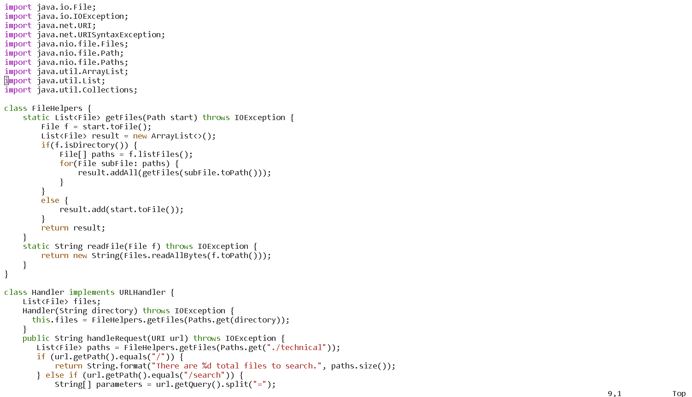
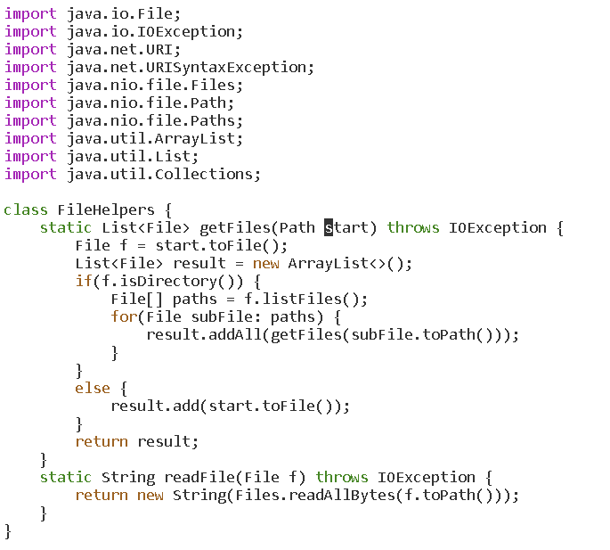
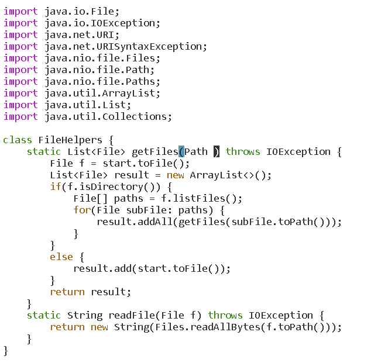
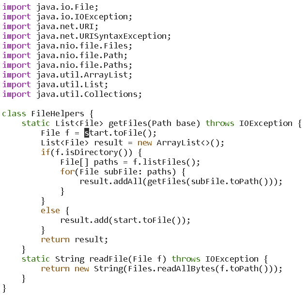
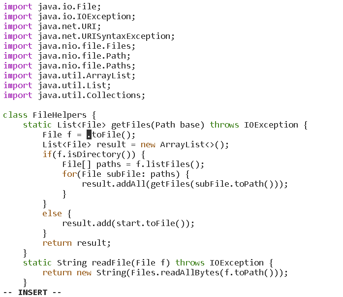
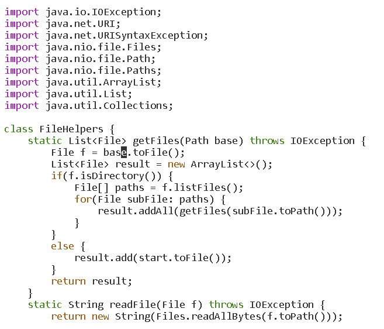
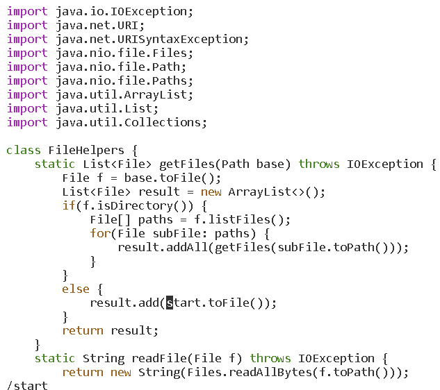
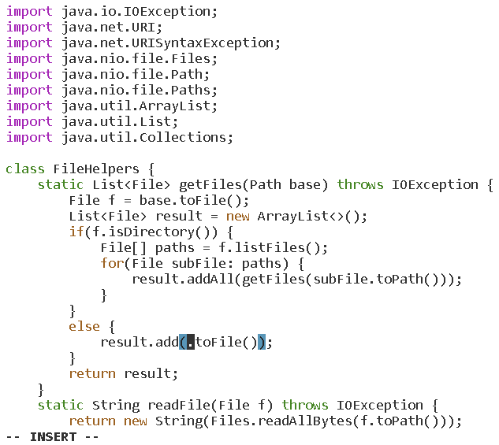
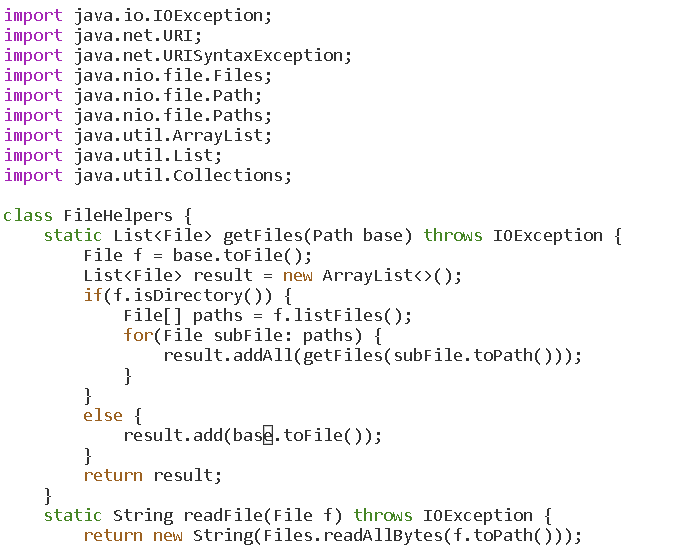
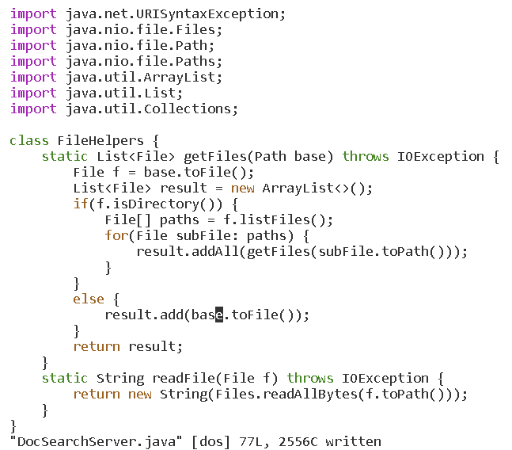

# Lab Report Week 7
## Replacing the start parameter with base

Open the file in vim with the following command:
```
vim DocSearchServer.java
```
The terminal should look something like this:



In order to replace the start parameter and all of its uses with base, it would be wise to search for a pattern to quickly traverse to the first occurrence of start.

To do so, typing "/" will search for a pattern that follows the "/". Press "enter" to exit out of the search and into normal mode:

```
/star<Enter>
```

Here, the cursor is now at the first occurrence of start, which is the parameter for the getFiles method:



Next, type ce. C in vim deletes all characters up to the movement range specified, and e means to go to the last character of the current word. Combining these two will delete the entire word, since it deletes every character up to and including the last character of the word:

```
ce
```



We are now in insert mode. Simply type "base", to insert base into the getFiles Path parameter. Press "esc" to exit insert mode.

```
base<Esc>
```

After exiting insert mode, press n to search for the next instance of "start". Vim keeps the search for start even after entering and exiting insert mode.

```
n
```


Repeat the process of pressing ce, then base<esc>, then n again etc.

```
ce
```


```
base<Esc>
```



```
n
```



```
ce
```


```
base<Esc>
```



Now we just need to save the file using :w.
```
:w<Enter>
```


We are now done replacing every instance of "start" in the getFiles method. The total sequence is this:

```
/star<Enter>cebase<Esc>ncebase<Esc>ncebase<Esc>:w
```

## Part 2

It took me 35 seconds to edit the file in VScode, copy it over to the remote server, ssh to the remote server, then run the file using bash test.sh

It took me 25 seconds to connect to the remote server, edit the file in Vim, then run the file using bash test

It is more advantageous to directly work on the remote server using vim. If one needs to test a program on the remote server and was using VScode on a local machine, then one would have to continously scp the file back and forth between the local and remote if there are any bugs found with testing. Using vim allows the user to directly edit a file on the remote server without having to copy files over and over again. However, if the project was mainly used on a local machine, and was just tested on a remote machine and not actually needed on a remote machine, then using VScode or other text editors are preferred. VScode has nice features that vim does not have, and is more intuitive to use. While vim is sometimes faster to use, it depends on the situation on whether I would use vim or VScode to edit files.