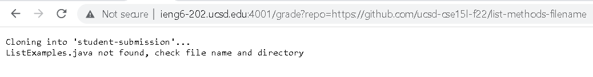
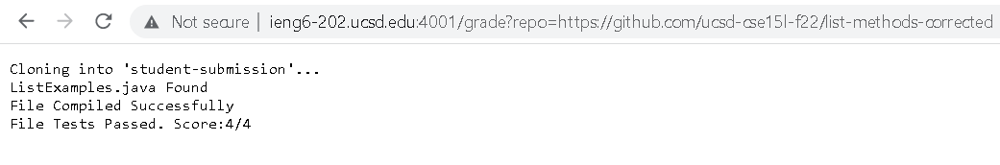
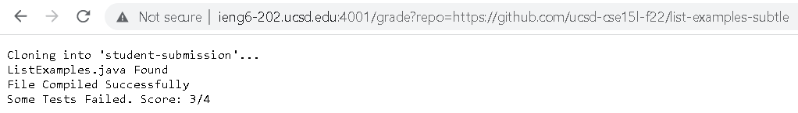

# Lab Report Week 8

## Part 1

My grade script:
```
rm -rf student-submission
mkdir student-submission
git clone $1 student-submission
cp ListExamplesTests.java student-submission
cp -r lib/ student-submission
cd student-submission
if [[ -e ListExamples.java ]]
then
    echo "ListExamples.java Found"
else
    echo "ListExamples.java not found, check file name and directory"
    exit
fi
javac -cp .:lib/hamcrest-core-1.3.jar:lib/junit-4.13.2/jar *.java 2> error1.txt
if [[ $? -eq 0 ]]
then
    echo "File Compiled Successfully"
else
    echo "File Failed to Compile"
    cat error1.txt
    exit
fi
java -cp .:lib/hamcrest-core-1.3.jar:.lib/junit-4.13.2.jar org.junit.runner.JUnitCore ListExamplesTests 2> error2.txt > output.txt
Test=$(sed -n '2p' output.txt)
TOTALTEST=$(echo $TEST | tr -d -c '.' | wc -m)
ERRORTEST=$(echo $TEST | tr -d -c 'E' | wc -m)
SCORETOP=$(($TOTALTEST-$ERRORTEST))
if [[ $? -eq 0 ]]
then
    if[[ $ERRORTEST -eq 0]]
    then
        echo "File Tests Passed. Score:"$SCORETOP"/"$TOTALTEST
    else
        echo "Some Tests Failed. Score: "$SCORETOP"/"$TOTALTEST
    fi
else
    echo "Runtime Error. Score: 0/"$TOTALTEST
    cat error2.txt
fi
```

List Examples Filename:



List Examples Correct Methods:



List Examples Subtle Errors:



## Part 2

In List examples filename, the filename is incorrect.

```
rm -rf student-submission
```

The return code is 0, since this command succeeds. There is no stdout or stderr.

```
mkdir student-submission
```

The return code is 0, since this command succeeds. There is no stdout or stderr.

```
git clone $1 student-submission
```

The return code is 0, since this command succeeds. The stderr is "Cloning into 'student-submission'...", and there is no stdout.

```
cp ListExamplesTests.java student-submission
```

The return code is 0, since the command succeeds. There is no stdout or stderr.

```
cp -r lib/ student-submission
```

The return code is 0, since the command succeeds. There is no stdout or stderr.

```
cd student-submission
```

The return code is 0, since the command succeeds. There is no stdout or stderr.

```
if [[ -e ListExamples.java ]]
```

This if condition is false, since the filename is not equal to ListExamples.java 

```
then
    echo "ListExamples.java Found"
```
These two lines do not run because the if statement was false

```
else
    echo "ListExamples.java not found, check file name and directory"
```

The return code is 0, since echo succeeds. The stdout is "ListExamples.java not found, check file name and directory", and there is no stderr.

```
exit
```

The return code is 0, since exit succeeds. There is no stdout or stderr.

```
java -cp .:lib/hamcrest-core-1.3.jar:.lib/junit-4.13.2.jar org.junit.runner.JUnitCore ListExamplesTests 2> error2.txt > output.txt
Test=$(sed -n '2p' output.txt)
TOTALTEST=$(echo $TEST | tr -d -c '.' | wc -m)
ERRORTEST=$(echo $TEST | tr -d -c 'E' | wc -m)
SCORETOP=$(($TOTALTEST-$ERRORTEST))
if [[ $? -eq 0 ]]
then
    if[[ $ERRORTEST -eq 0]]
    then
        echo "File Tests Passed. Score:"$SCORETOP"/"$TOTALTEST
    else
        echo "Some Tests Failed. Score: "$SCORETOP"/"$TOTALTEST
    fi
else
    echo "Runtime Error. Score: 0/"$TOTALTEST
    cat error2.txt
fi
```

The rest of my script does not run, since exit is called after the if statement is false.